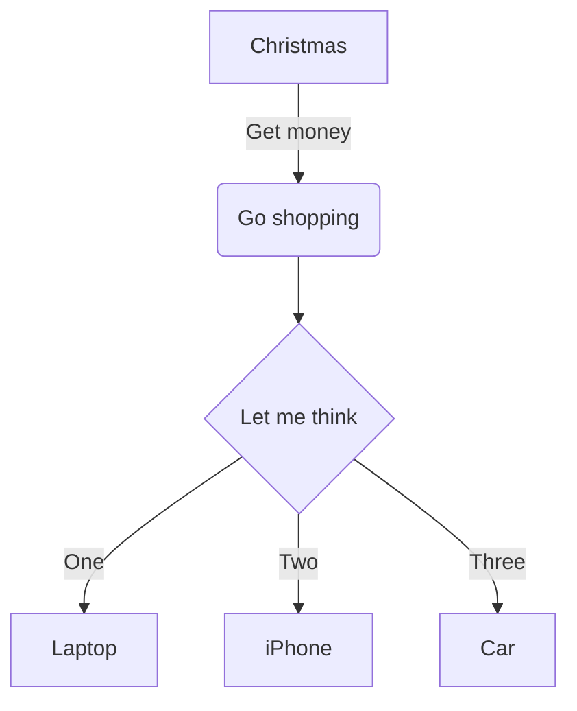

# Hello, world!

::: tip self-def
This is a tip
:::

::: warning self-def
This is a warning
:::

::: danger self-def
This is a danger
:::

::: info self-def
This is a info
:::

::: details self-def
This is a details
:::

| x   | y   | z   |
| --- | --- | --- |
| 1   | 2   | 3   |
| 4   | 5   | 6   |
| 7   | 8   | 9   |

```js
console.log("OK");
```

:frowning:^2^~2~==x==



# OK

$x^2+y^2=z^2$
